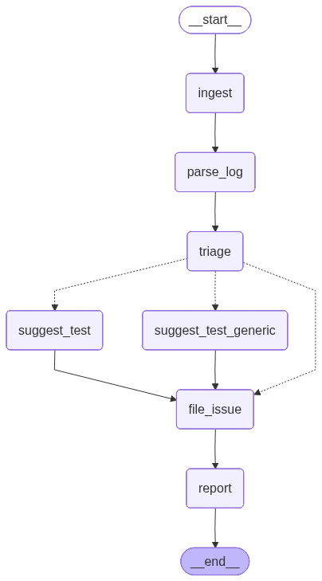

# Architecture

FailBot is a LangGraph-driven multi-agent pipeline that ingests CI logs, extracts error context, triages failures, suggests tests or strategies, and files GitHub issues.

## Data Flow

1. **Ingest**: Fetches a log from a URL or local file, truncates it with a head+tail strategy, and records the truncation reason.
2. **Parse Log**: Extracts error signature, files, and language from the truncated log.
3. **Triage**: Classifies category and severity; can call `lookup_error_patterns`.
4. **Suggest Test**: Generates a regression test for code bugs.
5. **Suggest Test Generic**: Produces a strategy for flaky or infra cases.
6. **File Issue**: Uses MCP or REST API to file an issue and falls back to a local draft when needed.
7. **Report**: Emits summary output and writes a JSON summary.

## Tool Binding

Tools are defined with `@tool` and bound to models via `get_bound_model()`. Tool execution is standardized via `ToolNode` when available.

## State

The pipeline uses a TypedDict state (see [src/state.py](../src/state.py)) that carries outputs from each node and is updated incrementally. The current state tracks log text, truncation metadata, token counts, timings, triage outputs, test suggestions, issue filing, and fallback flags.
